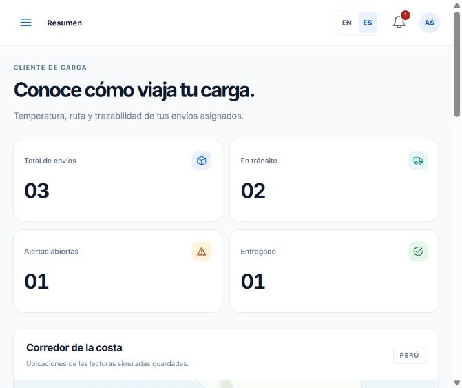
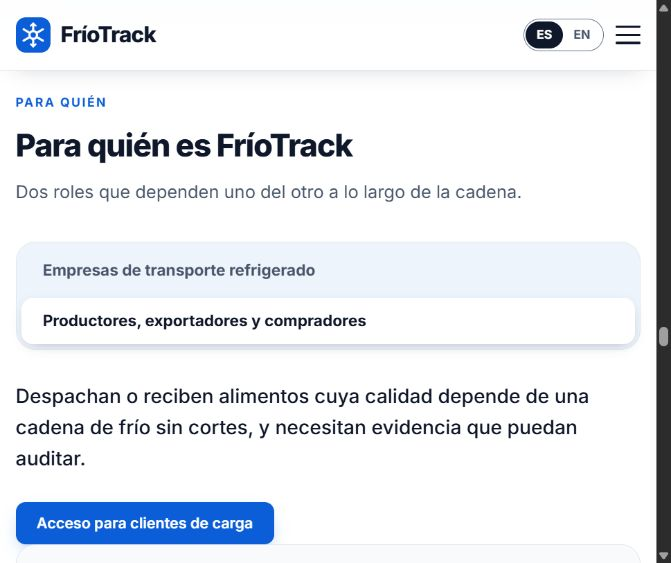

# Azure deployment and execution evidence

The frontend now uses email/password authentication through its supporting ASP.NET Core API. Academic labels and the sample-profile selector have been removed from the application interface. Operational seed records remain fictional; simulated readings are identified beside the monitoring view and in reports.

## Configuration

| Component | Deployment |
| --- | --- |
| Frontend | https://friotracktb1bce6db1b.z22.web.core.windows.net/ |
| Landing | https://friotracktb1bce6db1b.z22.web.core.windows.net/landing/ |
| API | https://friotrack-api-bce6db1b.azurewebsites.net/api |
| Azure resource group | `rg-friotrack-tb1` |
| Static hosting | StorageV2, Standard LRS, West US; `$web` container. |
| API hosting | Windows App Service, .NET 10, West US; `plan-friotrack-free`, Free F1. |
| Transport | HTTPS and minimum TLS 1.2. |
| Persistence | Single-instance JSON file under App Service `HOME/data`, outside the deployed public files. |

The account role is assigned by the API. Cargo clients receive only their own shipments and associated resources. Coordinator commands require a coordinator account in the server. Profile updates and public registration cannot grant coordinator permissions. Passwords use individually salted PBKDF2-SHA256 hashes, sessions have random tokens and eight-hour expiry, and sign-out revokes the server token. Login and registration requests are rate limited.

Initial account emails are recorded in the README. Generated passwords, Azure access tokens, Storage keys and `.azure-tools/accounts.json` are excluded from source control. The initial passwords are configured for the server at deployment and initialize the persisted accounts only on their first run. `.env.production` contains public endpoint URLs only.

## Reproduce from this repository

```powershell
rtk proxy npm.cmd ci
rtk proxy npm.cmd test
rtk proxy npm.cmd run build
rtk proxy npm.cmd ci --prefix scripts
rtk proxy dotnet publish api/FrioTrack.Api.csproj -c Release -o output/api-publish --no-self-contained
rtk proxy node scripts/test-api.mjs
rtk proxy dotnet run --project scripts/PackageApi/PackageApi.csproj
rtk proxy node scripts/deploy-api.mjs
rtk proxy node scripts/test-api.mjs --azure
rtk proxy node scripts/deploy-storage-tb1.mjs
rtk proxy node scripts/verify-azure.mjs
```

Run from the repository root. The deployment scripts use Microsoft Entra device authentication. API ZIP upload uses Kudu token authentication. Storage uploads only files under `dist/`, sets their content types and requires revalidation of HTML. Hash router URLs do not require server route rewrites. Publishing frontend files does not remove the separate landing already on the Storage site. A first deployment of the landing must use its own source repository.

The API plan is Free F1, has execution quotas and may require a cold start after inactivity. Azure Storage is charged according to usage. No paid database or paid App Service tier was created for this version. [Microsoft App Service documentation](https://learn.microsoft.com/en-us/azure/app-service/quickstart-dotnetcore), [Storage static websites](https://learn.microsoft.com/en-us/azure/storage/blobs/storage-blob-static-website).

## Verification records

| Verification | Result |
| --- | --- |
| Frontend domain tests | 15 passed. |
| API local integration suite | 24 checks passed before publication; the repository suite adds two development CORS checks, for 26 total. |
| API deployed HTTPS suite | 12 checks passed for authentication, role enforcement, isolation and session revocation. |
| Source compilation | Vue/Vite production build and ASP.NET Core publish succeeded. |
| Published content | 34 files from the original combined frontend/landing publication matched their local SHA-256 hashes; missing route returned HTTP 404. |
| Browser | Wrong password rejected; coordinator sees 4 shipments; client sees its 3 shipments; session restored after refresh; sign-out returns to login and subsequent dashboard access requires authentication. |

[Static deployment record](azure-deployment.json), [API deployment record](azure-api-deployment.json), [published-file verification](azure-file-verification.json), [API verification](azure-api-verification.json), [browser verification](azure-browser-verification.json).

The stored file verification describes the original combined Azure publication, including the separately maintained landing. A later run from this standalone repository verifies the files currently present under its own `dist/`.






The screenshots show the actual integrated browser viewport; they do not certify all screen sizes or full accessibility compliance. The API uses a single-instance file store appropriate for this project; physical sensors, transactional database, organization tenancy, password recovery, verified emails and external notifications remain future work.
